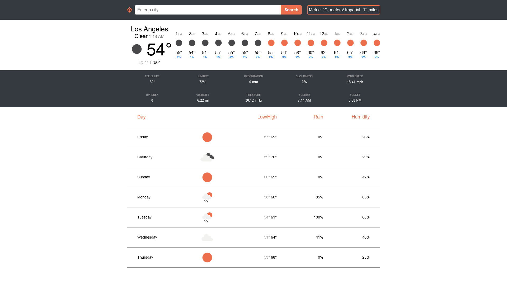
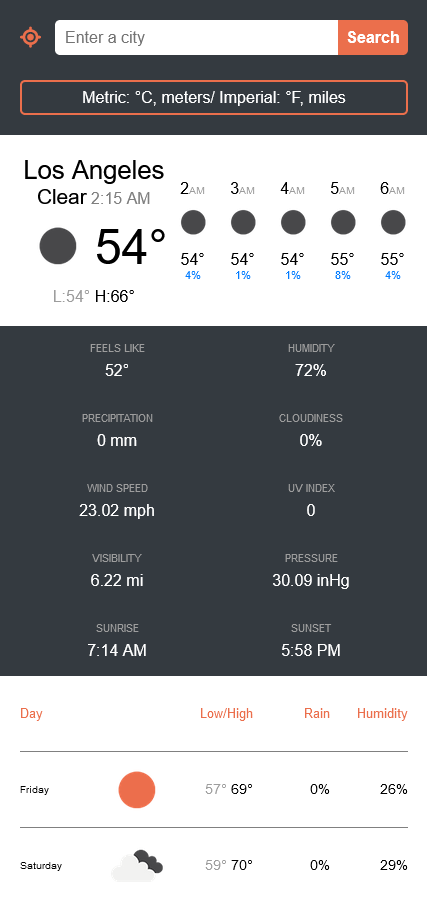

# weather-app




## Features

- Using the native browser geolocation API for current location
- Open Weather reverse geolocation API to get city name for native browser geolocation
- Nominatim geolocation for unlimited API calls for input searches
- Get current, minutely, hourly, daily, timezone data from Open Weather onecall API
- Toggle betwen imperial and metric units
- Responsive design, mobile ready
- Displays error for city not found and blocked requests
- Logs any other errors

## Install

Run install scrip to get dependencies

```sh
npm install
```

Make sure to set .env file with variable WEATHER_API

```sh
WEATHER_API=YOUR_API_HERE
```

### Build

Creates new html, js, css in dist folder

```sh
npm run build
```

### Development

Opens a new tab with live reload

```sh
npm run dev
```
